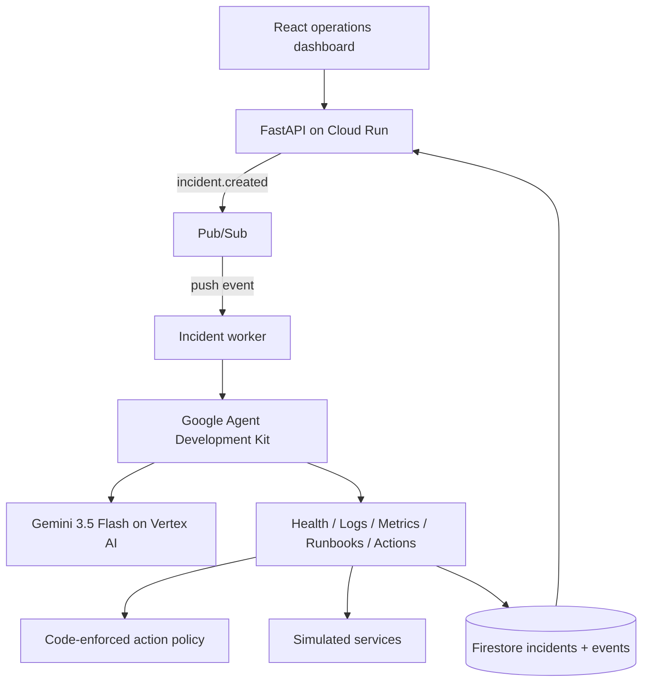

# AfterAlert

An autonomous IT incident response agent built for the **Google / Devpost All Things Agentic Hackathon 2026**, targeting **The Taskmaster** category.

> Repository: [Zachiran42/after-alert](https://github.com/Zachiran42/after-alert). Product name: **AfterAlert**.

## The problem

IT operators repeatedly receive an alert, gather health data and logs, correlate evidence, consult runbooks, select a remediation, verify recovery, and document the result. Delays and manual handoffs turn routine incidents into outages.

This project runs that workflow autonomously against safe, reproducible simulated infrastructure. It is an event-driven operational system—not a chatbot. An incident event starts a background workflow; Gemini chooses tools and actions through Google ADK; code enforces safety boundaries; the system verifies the outcome and persists an audit trail.

## Taskmaster workflow

1. Receive an alert event.
2. Inspect service health, logs, metrics, and dependencies.
3. Correlate evidence and search runbooks/history.
4. Choose an action through Gemini 3.5 Flash and Google ADK.
5. Enforce the action policy in the tool layer.
6. Execute a permitted remediation or create a precise escalation.
7. Verify the result.
8. Persist the incident and its observable event timeline.

The UI shows tool calls, observations, short decision summaries, and results. It never exposes private chain-of-thought.

## Features

- Deterministic recoverable scenario: `web-api` worker deadlock, stateless restart, health verification, and incident report.
- Unsafe scenario: database checksum corruption is investigated and escalated without a destructive action.
- Ten real ADK-callable Python tools with typed inputs, structured outputs, errors, policy checks, and correlated events.
- Explicit allow/escalate policy implemented in code.
- Google ADK 2.x runtime using Gemini 3.5 Flash through Vertex AI.
- Cloud Run deployment, Firestore persistence, and Pub/Sub background delivery.
- In-memory/local background fallbacks for fast, credential-free development and tests.
- Responsive operations dashboard with polling and deterministic demo controls.
- Idempotent worker behavior: only queued incidents run, so Pub/Sub redelivery cannot repeat a finished remediation.

## Architecture



See [docs/ARCHITECTURE.md](docs/ARCHITECTURE.md) for boundaries and failure handling.

## Technology

- Python 3.12, FastAPI, Pydantic, pytest
- Google Agent Development Kit 2.x
- Gemini 3.5 Flash (`gemini-3.5-flash`) through Vertex AI
- Google Cloud Run, Firestore, Pub/Sub, Cloud Build
- React, TypeScript, Vite
- Docker / Docker Compose

## Local setup

### One command (recommended)

```bash
docker compose up --build
```

Open <http://localhost:8080>. Local mode uses the deterministic offline runtime, in-memory persistence, and local background tasks. No cloud credentials or model tokens are consumed.

### Windows PowerShell native development

Backend (Python 3.12 or 3.13):

```powershell
cd backend
py -3.12 -m venv .venv
.\.venv\Scripts\Activate.ps1
pip install -e ".[dev]"
uvicorn app.main:app --reload --port 8080
```

Frontend in another terminal:

```powershell
cd frontend
npm install
$env:VITE_API_URL="http://localhost:8080"
npm run dev
```

Open <http://localhost:5173>.

## Environment variables

Copy `.env.example` to `.env` for local overrides. Never commit `.env` or credentials.

| Variable | Production value | Purpose |
|---|---|---|
| `AGENT_RUNTIME` | `adk` | Enables the genuine Google ADK runtime |
| `PERSISTENCE_BACKEND` | `firestore` | Stores incidents and events in Firestore |
| `EVENT_BACKEND` | `pubsub` | Publishes background incident events |
| `GOOGLE_CLOUD_PROJECT` | project ID | Google Cloud project |
| `GOOGLE_CLOUD_LOCATION` | `global` | Vertex AI location |
| `GOOGLE_GENAI_USE_VERTEXAI` | `true` | Routes Gemini through Vertex AI |
| `GEMINI_MODEL` | `gemini-3.5-flash` | Required application model |

Application Default Credentials are used; there is no API key in the repository.

## Google Cloud deployment

Prerequisites: a billed Google Cloud project, `gcloud`, authenticated user credentials, and permission to enable APIs/create resources. Review the script before running it; the script asks for the literal confirmation `DEPLOY` before creating billable resources.

```powershell
gcloud auth login
gcloud auth application-default login
.\scripts\deploy.ps1 -ProjectId "YOUR_PROJECT_ID"
```

The script enables Vertex AI, Cloud Run, Cloud Build, Artifact Registry, Firestore, and Pub/Sub; creates the topic/database when absent; deploys with `min-instances=0` and `max-instances=2`; creates/updates the push subscription; and prints the Cloud Run URL.

Cloud Run uses the service identity's Application Default Credentials. Grant least-privilege roles appropriate to your organization (Vertex AI User, Datastore User, and Pub/Sub Publisher/Subscriber) when the default deployment identity does not already have them.

## Demo procedure

1. Open the Cloud Run URL and show the runtime footer (`adk / firestore`).
2. Click **Trigger recoverable incident** and stop interacting.
3. Watch health/log/metric/runbook tool calls, policy approval, restart, verification, and resolution appear.
4. Open the incident audit record and Firestore documents.
5. Click **Trigger unsafe incident**.
6. Show the policy-blocked database action and evidence-rich escalation with zero restart.

See [docs/DEMO_SCRIPT.md](docs/DEMO_SCRIPT.md) for the four-minute narration.

## Tests

```bash
docker run --rm -v "${PWD}/backend:/app" -w /app python:3.12-slim \
  sh -c "pip install -e '.[dev]' && pytest -q"
cd frontend && npm ci && npm run build
docker build -t incident-response-agent .
```

The suite covers both scenarios, policy rejection, restart, post-remediation verification, persistence, failed tool execution, and API health/demo behavior. Gemini is not called by unit tests.

## Safety model

Automatically allowed: observation, runbook/history search, restart of a stateless simulated service, verification, reporting, and escalation.

Escalation required: data deletion/modification, firewall changes, credential changes, database restarts, disabling security controls, irreversible actions, and unknown actions. The Python tool layer rejects these even if a model requests them.

## Resilience and observability

- Incident IDs correlate structured JSON logs and timeline events.
- Pub/Sub duplicate messages are ignored once an incident leaves `queued`.
- Tool errors are recorded before propagation.
- Model/tool failure marks the workflow failed rather than inventing success.
- Firestore keeps the audit record independent of Cloud Run instance lifetime.
- Cloud Run timeout is bounded and instances scale to zero.

## Known limitations

- Infrastructure is intentionally simulated; no production host or database is modified.
- The local rule runtime is deterministic and exists for tests/demo rehearsal; only `AGENT_RUNTIME=adk` is hackathon production mode.
- Real Vertex AI/Firestore/Pub/Sub execution and Cloud Run screenshots must be verified after deployment to the submitter's project.
- Demo reset restores simulated service health but deliberately preserves the Firestore audit history.
- Pub/Sub push is deployed to the public Cloud Run endpoint for simple reproducibility; production use should add authenticated push and operator authorization.

## Hackathon compliance

- Newly created for All Things Agentic Hackathon 2026.
- Uses Gemini 3.5 Flash as the submitted application's runtime model.
- Uses Google ADK as the primary agent framework.
- Uses Cloud Run, Firestore, and Pub/Sub.
- Demonstrates event → plan/tool use → policy decision → action → verification → persistence.
- No OpenAI model is used by the application. Codex was used only as a development tool.

Deployment-dependent claims remain explicitly unverified until a real Cloud Run deployment is completed and captured.

## AI development disclosure and reused components

Codex/GPT-5.6 assisted with software development. The running application uses Gemini through Google's stack. No pre-existing application code or proprietary incident data was reused. Third-party open-source dependencies are listed in the package manifests and retain their own licenses.

## License

Add a human-selected license before making the submission repository public.
