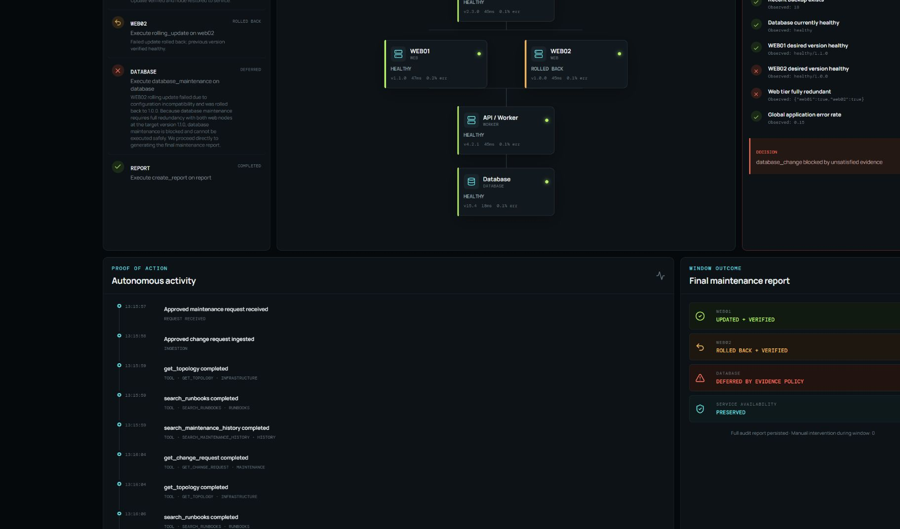
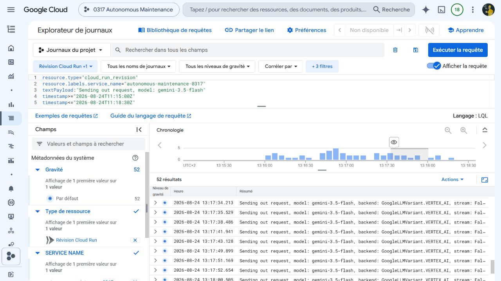
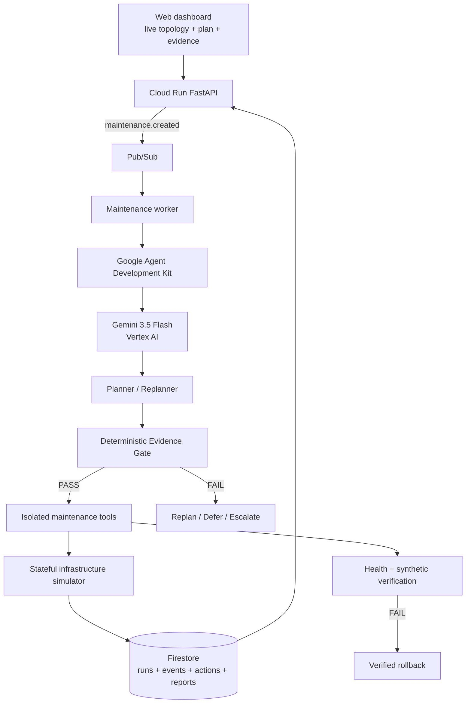

# 03:17

[](https://github.com/Zachiran42/0317-autonomous-maintenance/actions/workflows/quality.yml)

## Autonomous Maintenance Window

> **“Sleep through the maintenance window.”**

**03:17 autonomously executes approved after-hours infrastructure changes, verifies every step, rolls back failed changes, and refuses to continue when deterministic evidence no longer makes the next action safe.**

Built for the **Google / Devpost All Things Agentic Hackathon 2026**, targeting **The Taskmaster** track.

Repository: [Zachiran42/0317-autonomous-maintenance](https://github.com/Zachiran42/0317-autonomous-maintenance)

Devpost: [03:17 — Autonomous Maintenance](https://devpost.com/software/03-17-autonomous-maintenance)

Live demo: [autonomous-maintenance-0317](https://autonomous-maintenance-0317-iywxkz3msa-ew.a.run.app)

Final demo video: [03:17 — Autonomous Maintenance with Gemini 3.5, Google ADK & Evidence Gates](https://youtu.be/gvNR-WHC1G0)

License: [MIT](LICENSE)

The name **03:17** represents the moment an unattended maintenance window stops following the runbook—the hour when no sysadmin wants to be awake. The system is designed to handle that deviation with evidence, rollback, and a complete audit trail.

## The problem

Traditional infrastructure automation assumes that the runbook will work. Real maintenance windows do not.

Administrators stay awake because somebody must interpret an unexpected health check, decide whether it is safe to continue, roll back a failed change, and adapt the remaining plan. The commands are often routine; the difficult part is handling reality when it diverges from the happy path.

03:17 automates that judgment layer without giving a probabilistic model unrestricted authority.

## The central idea: Autonomous Change with Evidence Gates

Gemini interprets the change request, discovers context through tools, creates the plan, and replans after unexpected observations. Deterministic Python code controls authorization, evidence thresholds, tool arguments, rollback eligibility, and state transitions.

```text
Gemini / Google ADK proposes the next objective
                       |
                       v
                 Evidence Gate
                 /           \
              PASS           FAIL
               |              |
               v              v
             ACTION      REPLAN / DEFER
               |
               v
             VERIFY
            /      \
         PASS      FAIL
          |          |
       NEXT STEP   ROLLBACK
                     |
                     v
                   VERIFY
```

This visibly demonstrates **probabilistic reasoning plus deterministic execution safety**.

## Golden demonstration

The included stateful infrastructure simulator models:

```text
                 LOAD BALANCER
                  /          \
              WEB01          WEB02
                 \            /
                  API / WORKER
                       |
                   DATABASE
```

One approved request starts the entire asynchronous workflow:

> Update the web tier and perform the approved database maintenance during tonight's maintenance window. Preserve service availability where possible. Validate every target before continuing and rollback failed changes.

The reproducible outcome is:

| Target | Autonomous result | Proof |
|---|---|---|
| WEB01 | Updated and restored | Drain, rollback point, update, restart, health check, synthetic test, error threshold, pool restore |
| WEB02 | Rolled back | Functional test fails at 24% errors; logs and metrics collected; rollback selected and verified |
| DATABASE | Deferred | Backup and DB health pass; target-version redundancy and WEB02 target state fail |
| Availability | Preserved | At least one verified web node remains in service throughout |
| Human intervention | 0 | The workflow continues after one approved request |

The simulator does not fake UI status. Tools mutate backend node version, lifecycle state, health, error rate, logs, load-balancer membership, snapshots, and rollback points. The dashboard polls that real state.

## Verified production evidence

The deployed golden run completed on Google Cloud with availability preserved and zero human intervention.



Cloud Logging records Gemini 3.5 Flash requests through the Vertex AI backend, while the correlated maintenance logs retain the maintenance ID and tool outcomes.



See [the complete cloud proof](docs/CLOUD_PROOF.md) and [all submission captures](docs/screenshots/).

Watch the [final 1:56 continuous live demonstration on YouTube](https://youtu.be/gvNR-WHC1G0), including the verified failure, structured replanning, rollback, downstream evidence refusal, final audit report, and visible Google Cloud proof. The live execution is shown uniformly at 2× speed and is identified as such on screen.

## Architecture



See [the detailed architecture](docs/ARCHITECTURE.md) and [renderable SVG](docs/architecture.svg).

## Why this is agentic—not a deployment script

- Gemini uses Google ADK tools to inspect the request, topology, health, metrics, logs, runbooks, history, and capacity.
- Gemini may create different valid plans based on the approved request and observed state; Python does not require one exact golden sequence.
- A dedicated semantic validator checks target/action combinations, approved scope, explicit dependencies, cycles, serialization, and terminal reporting.
- The executor schedules the next eligible step from persisted dependency and outcome state rather than iterating over a fixed target list.
- Verification failures and Evidence Gate rejections return to Gemini as observations; structured replans add, revise, or defer actual executable steps.
- A proposed rollback becomes a plan objective, but ownership, rollback eligibility, Evidence Gates, tool scope, and verification remain deterministic.
- Tool execution, safety, rollback eligibility, and state transitions remain deterministic.
- The local planner is used only for deterministic, zero-token tests and rehearsal; deployed mode uses ADK/Vertex AI.

The golden demo remains deterministic for reproducibility, but its execution engine is not tied to a hard-coded target sequence. Gemini emits a validated dependency-aware plan, and replanning changes the persisted remaining workflow.

No private chain-of-thought is shown or stored. Only objectives, tool calls, observations, concise decision summaries, policy outcomes, and results are exposed.

## Technology

- Python 3.12, FastAPI, Pydantic, pytest, Ruff
- Google Agent Development Kit 2.x
- Gemini 3.5 Flash through Vertex AI
- Google Cloud Run, Firestore, Pub/Sub, Cloud Build
- React, TypeScript, Vite
- Docker and Docker Compose

## Repository structure

```text
backend/app/
  agent.py          ADK planner, local planner, safe executor, replanning
  models.py         maintenance state machine, plans, evidence, actions, events
  policy.py         deterministic Evidence Gates and action categories
  simulator.py      stateful five-node synthetic infrastructure
  tools.py          isolated, observable, idempotent ADK-callable tools
  repository.py     in-memory and Firestore persistence
  events.py         Pub/Sub publisher
  main.py           API, worker endpoint, dashboard serving
frontend/           live maintenance command center
scripts/            PowerShell and Bash Google Cloud deployment
docs/               architecture, safety, demo, Devpost, judging, migration
```

## Local setup

### One command

```bash
docker compose up --build
```

Open <http://localhost:8080>, click **Start autonomous maintenance**, and do not interact again. Local mode uses the deterministic planner, in-memory persistence, and local background tasks. It consumes no model tokens.

The Compose profile adds a short `DEMO_STEP_DELAY_SECONDS` so state changes remain visible. This is presentation pacing only; actions still execute against real simulator state.

### Windows PowerShell development

Backend with Python 3.12 or 3.13:

```powershell
cd backend
py -3.12 -m venv .venv
.\.venv\Scripts\Activate.ps1
pip install -e ".[dev]"
uvicorn app.main:app --reload --port 8080
```

Frontend in a second terminal:

```powershell
cd frontend
npm install
$env:VITE_API_URL="http://localhost:8080"
npm run dev
```

Open <http://localhost:5173>.

## Environment variables

Copy `.env.example` to `.env` for local overrides. Never commit `.env`, API keys, credential files, or service-account JSON.

| Variable | Production value | Purpose |
|---|---|---|
| `AGENT_RUNTIME` | `adk` | Uses Gemini/Google ADK for planning and replanning |
| `PERSISTENCE_BACKEND` | `firestore` | Persists runs, actions, events, and reports |
| `EVENT_BACKEND` | `pubsub` | Executes approved requests asynchronously |
| `GOOGLE_CLOUD_PROJECT` | project ID | Target Google Cloud project |
| `GOOGLE_CLOUD_LOCATION` | `global` | Vertex AI endpoint location |
| `GOOGLE_GENAI_USE_VERTEXAI` | `true` | Routes Gemini through Vertex AI |
| `GEMINI_MODEL` | `gemini-3.5-flash` | Hackathon runtime model |
| `PUBSUB_TOPIC` | `maintenance-events` | Approved request event topic |
| `DEMO_STEP_DELAY_SECONDS` | `0.45` | Makes real state transitions legible in the demo |

Application Default Credentials are used; no runtime secret is stored in this repository.

## Google Cloud deployment

Prerequisites: a billed Google Cloud project, authenticated `gcloud`, Application Default Credentials, and appropriate IAM permissions. Review the script before executing it. It asks for the literal confirmation `DEPLOY` before creating potentially billable resources.

```powershell
gcloud auth login
gcloud auth application-default login
.\scripts\deploy.ps1 -ProjectId "YOUR_PROJECT_ID"
```

The script enables the required APIs, creates Firestore and Pub/Sub resources when absent, deploys `autonomous-maintenance-0317` to Cloud Run, configures scale-to-zero with one maximum instance for deterministic simulator state, creates/updates the push subscription, and prints the Cloud Run URL.

Cloud deployments should use a dedicated least-privilege service identity with Vertex AI User, Datastore User, Pub/Sub Publisher, and Pub/Sub Subscriber access. The current simple push endpoint is public for hackathon reproducibility; authenticated Pub/Sub push is the first production-hardening task.

## API

| Endpoint | Purpose |
|---|---|
| `GET /api/health` | Liveness |
| `GET /api/topology` | Current infrastructure state |
| `GET /api/maintenance` | Maintenance history |
| `POST /api/maintenance` | Submit one approved change request |
| `GET /api/maintenance/{id}` | Plan, gates, actions, and report |
| `GET /api/maintenance/{id}/events` | Auditable event timeline |
| `POST /api/demo/start` | Seed the golden request |
| `POST /api/demo/reset?scenario=golden` | Restore the golden synthetic scenario |
| `POST /api/demo/reset?scenario=degraded-preflight` | Seed unsafe pre-flight health for refusal testing |
| `POST /api/events/pubsub` | Pub/Sub push worker |

## Tests and validation

```bash
docker run --rm -v "${PWD}/backend:/app" -w /app python:3.12-slim \
  sh -c "pip install -e '.[dev]' && ruff check app tests && pytest -q"
cd frontend && npm ci && npm run build
docker build -t autonomous-maintenance-0317 .
```

The 35-test deterministic suite covers alternative valid plans, invalid and cyclic dependency graphs, dependency-aware scheduling, structured plan revisions, both simulator scenarios, measured availability, forced outage memory, request ingestion, gates, rollback ownership and verification, DB refusal, idempotency, persistence, forbidden actions, backend endpoints, duplicate events, and the complete golden scenario. Tests replace model calls with deterministic fixtures and consume no tokens.

## Safety and resilience

- Read operations are automatically allowed.
- Safe changes require explicit evidence gates.
- Rollback requires a verified rollback point and proof that the current run owns the changed state.
- Restricted and unknown actions fail closed.
- Every meaningful action has an idempotency key and execution record.
- Duplicate Pub/Sub deliveries cannot restart a completed run.
- Invalid state transitions raise an error.
- Malformed Gemini plans are validated and retried only within a bounded loop.
- Tool errors and failed verification are persisted instead of converted into invented success.

See [SAFETY_MODEL.md](docs/SAFETY_MODEL.md).

## Four-minute demo

The product is engineered for one unedited run:

1. Submit the approved request once.
2. Watch Gemini plan and the pre-flight gates pass.
3. Watch WEB01 drain, update, verify, and return.
4. Watch WEB02 fail its synthetic test and roll back autonomously.
5. Watch the database Evidence Gate fail target-version redundancy.
6. Watch Gemini replan and defer database maintenance.
7. Show the report, Firestore records, Pub/Sub delivery, Cloud Run service, and Vertex AI logs.

See [DEMO_SCRIPT.md](docs/DEMO_SCRIPT.md).
Use [CAPTURE_CHECKLIST.md](docs/CAPTURE_CHECKLIST.md) for the exact product and Google Cloud screenshots required for submission.

## Known limitations

- The infrastructure is synthetic and cannot affect an employer or real production system.
- The process-local simulator is intentionally small; Firestore persists workflow/audit state, but simulator state itself should move to a transactional persistent adapter for multi-instance production use.
- The previous verified Vertex AI, Firestore, Pub/Sub, and Cloud Run execution is documented in [CLOUD_PROOF.md](docs/CLOUD_PROOF.md). The dependency-aware hardening is locally and CI verified but requires a new deployment before it can be claimed as production evidence.
- Pub/Sub push authentication and transactional run claiming are documented production-hardening items.
- PDF/image change-request ingestion is deferred until the core submission proof and video are complete.

## Hackathon compliance

- Built during the All Things Agentic Hackathon 2026 period.
- Targets The Taskmaster with a complete event-to-outcome workflow.
- Uses Gemini 3.5 Flash as deployed runtime intelligence.
- Uses Google ADK as the agent framework.
- Uses Vertex AI, Cloud Run, Firestore, and Pub/Sub.
- Shows real tool execution, state mutation, verification, rollback, evidence refusal, persistence, and reporting.
- Uses no OpenAI model at application runtime.
- Contains no employer names, private infrastructure, credentials, tickets, logs, or proprietary data.

Cloud-dependent claims for the final hardened revision `00006-m8m` and both production scenarios are backed by the API and Firestore evidence in [CLOUD_PROOF.md](docs/CLOUD_PROOF.md). The submitted video remains historical evidence from revision `00002-962`; the proof document keeps that boundary explicit.

## AI development disclosure and reused work

Codex/GPT-5.6 assisted with development. Gemini is the submitted application's runtime model. The project reused only its own hackathon-period scaffolding—ADK integration, cloud adapters, simulator patterns, dashboard structure, and tests—then migrated them to the maintenance-window domain. No pre-hackathon application or confidential component was reused.

## License

Released under the [MIT License](LICENSE).
