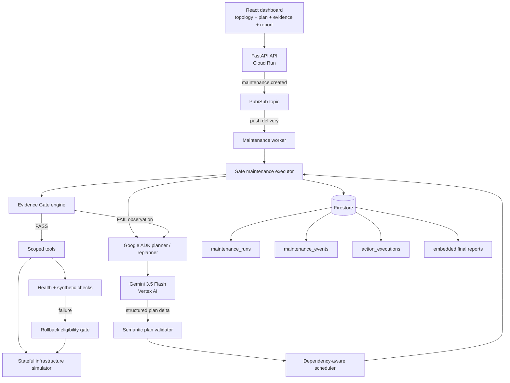

# 03:17 Architecture

## System topology



## Responsibility split

| Component | Responsible for | Never responsible for |
|---|---|---|
| Gemini / ADK | Interpreting requests, selecting observations, structured planning, replanning, concise explanations | Direct authority over dangerous changes |
| Plan validator | Approved scope, target/action semantics, dependency integrity, cycle rejection, report ordering | Current operational safety |
| Safe executor | Selecting the next eligible persisted step, bounded loop, workflow status | Inventing evidence |
| Evidence Gate | Thresholds, authorization, rollback eligibility, fail-closed decisions | Natural-language reasoning |
| Tools | Validated state reads/mutations, idempotency, structured results, errors | Arbitrary shell or unrestricted infrastructure access |
| Simulator | Real synthetic node state and fault injection | Fake UI outcomes |
| Repository | Durable run, event, action, and report state | Hidden model reasoning |

## Stateful execution

```text
RECEIVED → PLANNING → VALIDATED PLAN → PREFLIGHT → READY → EXECUTING
                                             |
                                             v
                                         VERIFYING
                                         /       \
                                      PASS       FAIL
                                       |           |
                                  EXECUTING   REPLANNING
                                                   |
                                                   v
                                          VALIDATED ROLLBACK STEP
                                                   |
                                                   v
                                             ROLLING_BACK
                                                   |
                                                   v
                                     COMPLETED_WITH_WARNINGS
```

Every transition is validated against an explicit transition map. Invalid transitions raise `TransitionError` and are covered by tests.

## Dynamic planning

The production planner adapter is a Google ADK agent using Gemini. It may call request, topology, health, metric, log, runbook, history, capacity, and availability tools. It submits stable step IDs, explicit dependencies, targets, actions, and objectives through `submit_maintenance_plan`.

`PlanValidator` accepts any semantically admissible plan within the approved request scope. It rejects unknown/restricted actions, unknown targets, missing/self/cyclic dependencies, parallel rolling updates, database steps without declared web dependencies, and reports that are not terminal. It does not evaluate live safety.

The scheduler selects pending steps whose dependency outcomes make that specific action eligible. Maintenance children cannot run after blocked/deferred dependencies, while the report may run after all actionable work reaches any terminal outcome.

After failed verification, the executor sends the observable synthetic result, logs, and metrics back to the planner. The structured replan adds a rollback objective and updates downstream dependencies in persisted state. Deterministic ownership and rollback Evidence Gates still authorize the tool. After the database gate rejection, a second structured replan changes the database step itself to `deferred`, making the report the next eligible step. Both revisions emit `plan_revised` with old plan, updated plan, concise summary, and triggering observation.

Tests substitute `LocalPlanner` for Gemini. It implements the same planner interface but is explicitly identified as a deterministic test runtime.

## Evidence Gates

The engine evaluates four visible gates:

1. **Maintenance window:** approved request, all initial health, minimum capacity, recent verified backup.
2. **Drain node:** enough remaining healthy web capacity.
3. **Apply web change:** target drained and verified rollback point present.
4. **Rollback:** rollback point exists and the current maintenance owns the changed state.
5. **Database change:** backup, DB health, both target versions healthy, full redundancy, global error threshold.

The golden run intentionally fails the last gate because WEB02 was restored to its previous version.

## Availability proof

The simulator measures healthy serving web nodes, the required serving-node count, serving targets, and global error rate. The executor persists an `availability_check` after initial observation and every important mutation or verification. `availability_preserved` is monotonic: once any observation is unavailable it can never return to `true`. The final report is derived from the persisted observations rather than the model default.

## Idempotency and resumption

- API event IDs deduplicate repeated request ingestion.
- Mutating tools use `{maintenance_id}:{action}:{target}` keys.
- Successful repeated mutations return their stored result and emit an `idempotent_replay` event.
- Only `RECEIVED` runs are claimed by the process, preventing completed Pub/Sub redeliveries from repeating work.
- Firestore stores runs, events, and action executions independently of Cloud Run instance lifetime.

Before multi-instance production use, run claiming should be upgraded to a Firestore transaction/lease. This limitation is intentionally documented rather than hidden.

## Failure handling

- Malformed or unsupported Gemini plan steps fail validation.
- Initial planning uses two bounded attempts.
- Tool exceptions emit error events and propagate.
- Failed functional verification cannot be converted into success; it triggers rollback evaluation.
- Failed rollback verification marks the run failed.
- Restricted or unknown actions fail closed.
- Pub/Sub/Cloud Run provide transport retries; tool idempotency prevents repeated mutations.

## Observability and privacy

Events include `maintenance_id`, `action_id`, actor, event type, target, status, timestamp, tool, and structured evidence. They expose actions and observations, never private chain-of-thought. The UI renders final outcomes from the live plan/report and visually identifies agent, policy, action, tool, and verification events.

See [SAFETY_MODEL.md](SAFETY_MODEL.md) and [architecture.svg](architecture.svg).
